# Chess Games Analysis Dashboard

Comprehensive analysis of chess performance data from combined PGN files (IsmatS and Cassiny), featuring 18 high-quality analytical charts covering 10,961 games.

## 📊 Chart 1: Win Rates Overview

**Key Insights:**
- Overall win rate distribution and player statistics comparison
- Performance baseline establishment for both players
- Statistical significance of results across different game outcomes

**Opportunities:**
- Identify which player has more consistent performance
- Understand the gap between players' skill levels
- Benchmark current performance for future improvement tracking

**Actionable Insights:**
- Focus training on areas where win rates are below 50%
- Analyze what contributes to higher win rates for the stronger player
- Set realistic improvement targets based on current performance levels

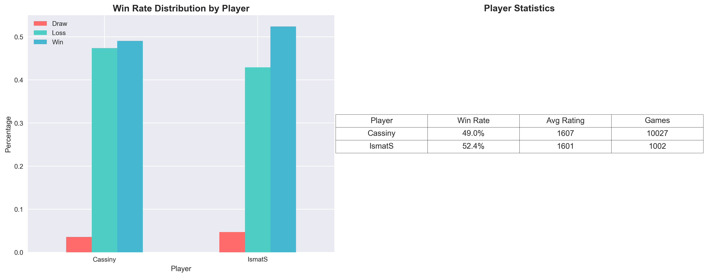

---

## 📈 Chart 2: Rating Evolution

**Key Insights:**
- Rating progression patterns over time
- Periods of improvement vs. stagnation or decline
- Long-term performance trends and volatility

**Opportunities:**
- Identify optimal learning periods when rating improved most rapidly
- Spot pattern disruptions that led to rating drops
- Understand seasonal or temporal factors affecting performance

**Actionable Insights:**
- Replicate training methods used during rating improvement periods
- Investigate external factors during rating decline periods
- Implement consistent practice schedules based on successful patterns

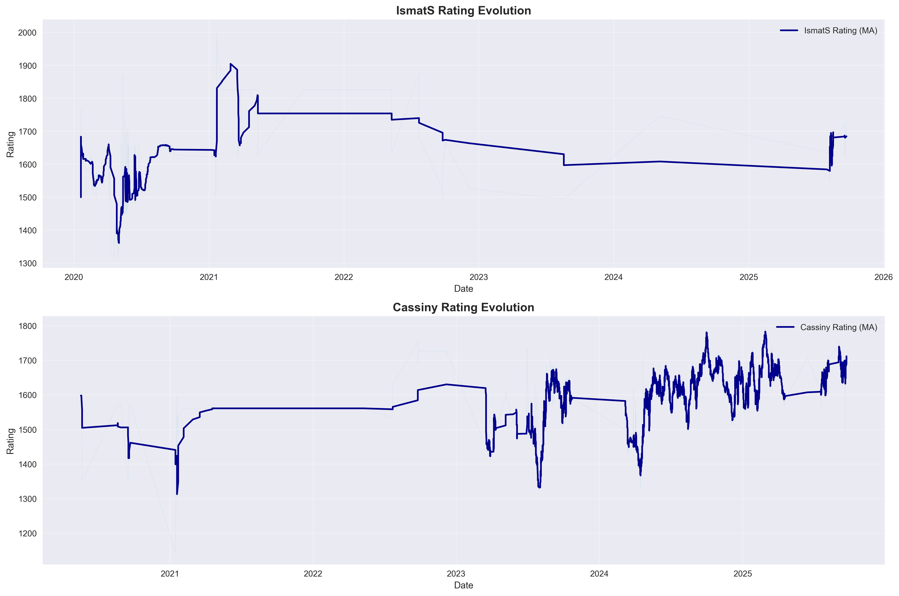

---

## ♟️ Chart 3: Opening Analysis

**Key Insights:**
- Most frequently played openings and their success rates
- Opening repertoire breadth vs. depth analysis
- Performance correlation between opening choice and outcomes

**Opportunities:**
- Expand successful opening lines while reducing unsuccessful ones
- Identify gaps in opening knowledge that opponents exploit
- Develop specialized expertise in high-performing openings

**Actionable Insights:**
- Study and practice the top 3-5 most successful openings more deeply
- Eliminate or improve openings with win rates below 40%
- Learn standard middle-game plans for your best-performing openings

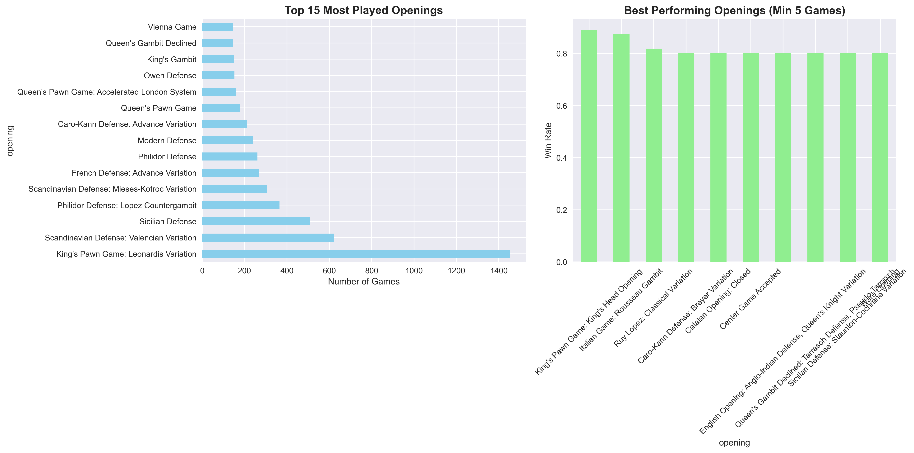

---

## ⏱️ Chart 4: Time Control Performance

**Key Insights:**
- Performance variation across different time formats
- Optimal time control identification for each player
- Time management effectiveness in different formats

**Opportunities:**
- Focus training on time controls where performance lags
- Leverage strengths in preferred time formats
- Improve time management skills for weaker formats

**Actionable Insights:**
- Practice more games in time controls with lower win rates
- Develop time management strategies specific to each format
- Consider specializing in time controls where you perform best

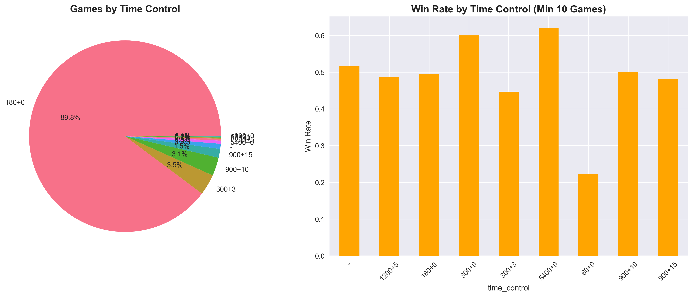

---

## ⚫⚪ Chart 5: Color Performance

**Key Insights:**
- Win rate differences between playing White and Black
- Color-specific strengths and weaknesses
- Opening choice impact based on piece color

**Opportunities:**
- Improve performance with the weaker color
- Maximize advantages when playing the stronger color
- Balance opening repertoire for both colors

**Actionable Insights:**
- Study defensive techniques if Black performance is weaker
- Practice aggressive openings if White performance is stronger
- Learn color-specific opening principles and strategies

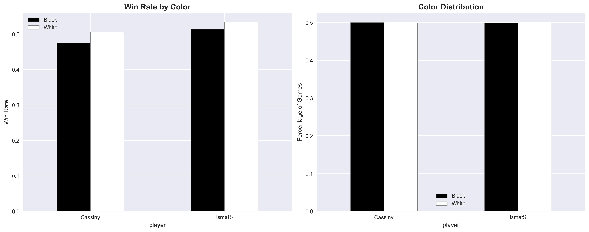

---

## 🏁 Chart 6: Termination Analysis

**Key Insights:**
- How games typically end (checkmate, resignation, timeout, etc.)
- Endgame strength assessment
- Game conclusion patterns and decision-making

**Opportunities:**
- Improve endgame technique if too many draws occur
- Develop resignation timing if games drag on unnecessarily
- Enhance time management if timeouts are frequent

**Actionable Insights:**
- Study endgame theory if many games end in draws
- Practice time management if timeout losses are common
- Learn when to resign vs. fight in difficult positions

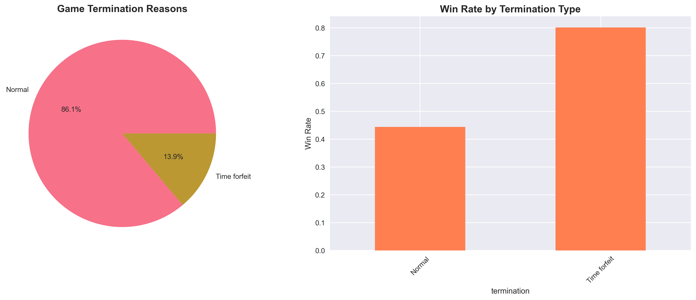

---

## 🕐 Chart 7: Time of Day Performance

**Key Insights:**
- Optimal playing hours and circadian performance patterns
- Peak performance windows during the day
- Time-based concentration and decision-making quality

**Opportunities:**
- Schedule important games during peak performance hours
- Avoid playing during consistently poor-performing times
- Understand energy level impacts on chess performance

**Actionable Insights:**
- Play rated games during your statistically best hours
- Use poor-performing hours for study and analysis
- Maintain consistent sleep and meal schedules for optimal timing

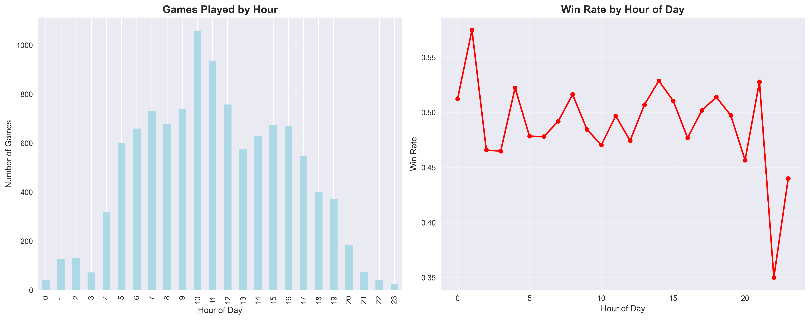

---

## 📅 Chart 8: Monthly Activity and Trends

**Key Insights:**
- Seasonal performance patterns and activity levels
- Long-term improvement or decline trends
- External factor impacts on chess performance

**Opportunities:**
- Identify optimal seasons for intensive training
- Plan tournament participation during strong months
- Address seasonal performance variations

**Actionable Insights:**
- Increase training intensity during historically strong months
- Prepare extra motivation strategies for traditionally weak periods
- Track external factors (work, school, life events) that correlate with performance

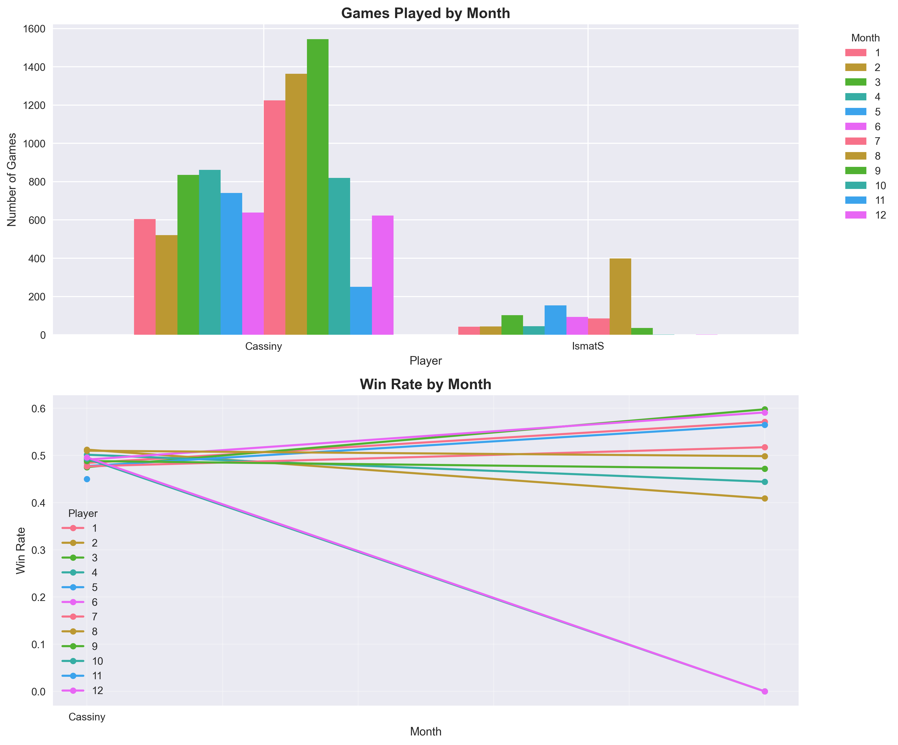

---

## 💪 Chart 9: Opponent Strength Analysis

**Key Insights:**
- Performance against different rating ranges
- Ability to punch above or below weight class
- Rating difference impact on game outcomes

**Opportunities:**
- Improve performance against higher-rated opponents
- Maintain consistency against lower-rated players
- Understand rating-based expectation management

**Actionable Insights:**
- Study games against higher-rated opponents to learn advanced concepts
- Practice maintaining focus against lower-rated opponents
- Set realistic expectations based on rating differences

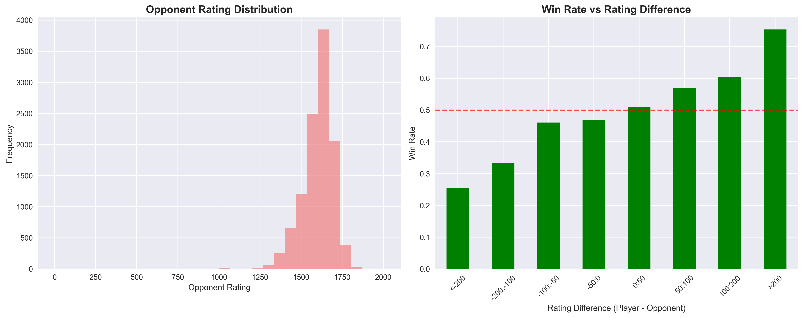

---

## 📏 Chart 10: Game Length Analysis

**Key Insights:**
- Optimal game length for peak performance
- Endgame vs. tactical strength indicators
- Stamina and concentration patterns in longer games

**Opportunities:**
- Improve performance in suboptimal game length ranges
- Leverage strengths in preferred game durations
- Develop stamina for longer games if needed

**Actionable Insights:**
- Practice endgame positions if longer games show poor performance
- Work on opening preparation if short games are problematic
- Build concentration stamina through longer practice sessions

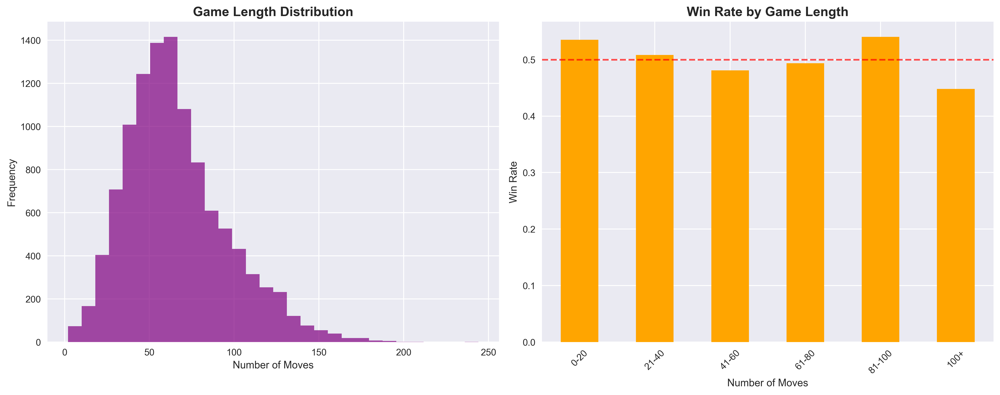

---

## 📊 Chart 11: Performance Streaks

**Key Insights:**
- Performance consistency and trend analysis over time
- Streak patterns and momentum factors
- Long-term stability vs. volatility assessment

**Opportunities:**
- Extend positive streaks through momentum maintenance
- Minimize negative streak duration and impact
- Develop consistent performance regardless of recent results

**Actionable Insights:**
- Create pre-game routines to maintain positive momentum
- Develop resilience strategies for breaking negative streaks
- Track emotional and mental state correlation with performance trends

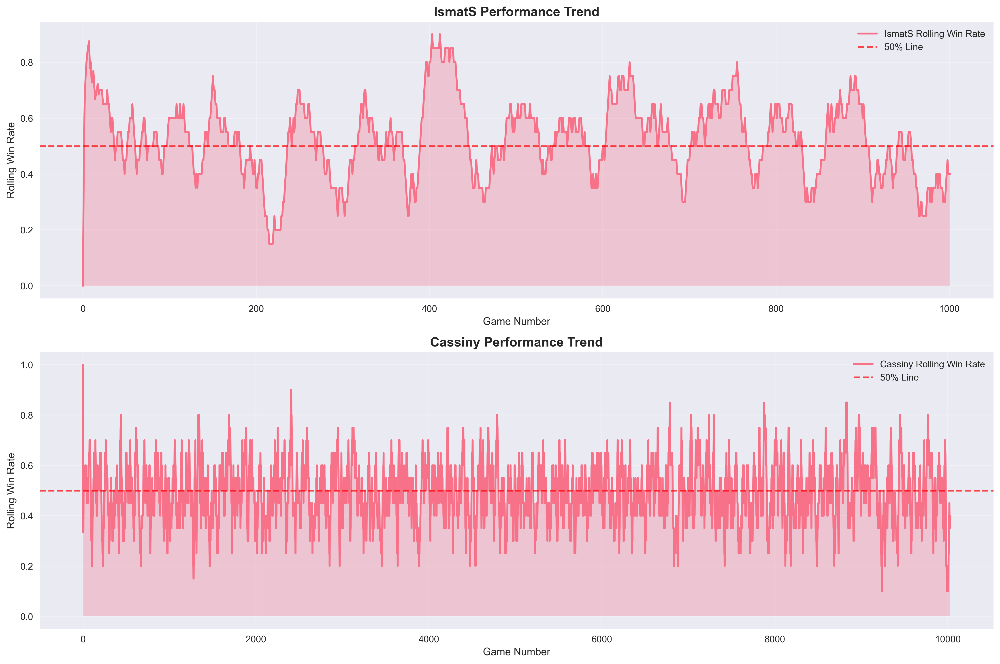

---

## 📆 Chart 12: Weekday vs Weekend Performance

**Key Insights:**
- Work-life balance impact on chess performance
- Rest vs. activity correlation with game outcomes
- Weekly rhythm optimization for chess improvement

**Opportunities:**
- Optimize weekly schedule for peak chess performance
- Address weekday vs. weekend performance gaps
- Balance chess training with other life commitments

**Actionable Insights:**
- Schedule important games on statistically stronger days
- Use weaker days for study and analysis rather than rated games
- Adjust sleep and preparation routines based on day-of-week patterns

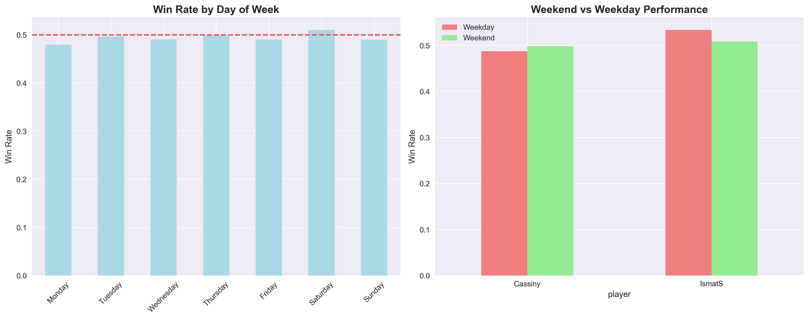

---

## 🌸 Chart 13: Seasonal Performance

**Key Insights:**
- Year-round performance patterns and seasonal variations
- External environment impact on chess ability
- Long-term cyclical performance trends

**Opportunities:**
- Plan training intensification during strong seasons
- Prepare countermeasures for traditionally weak seasons
- Understand environmental factors affecting performance

**Actionable Insights:**
- Schedule tournaments during historically strong seasons
- Increase study time during seasons with lower performance
- Track and address lifestyle factors that vary seasonally

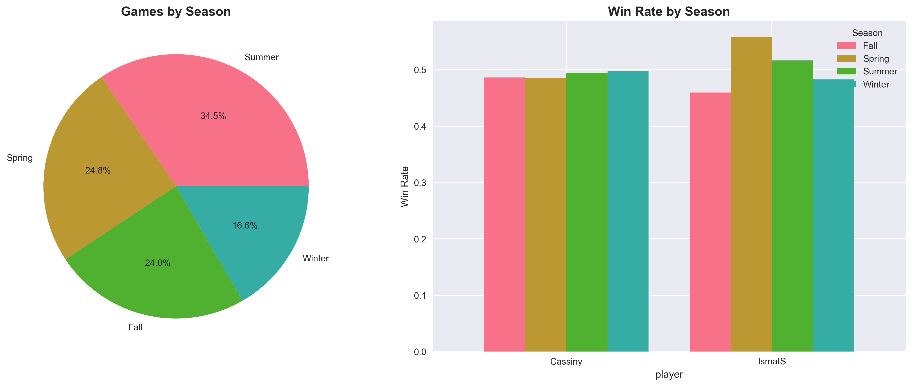

---

## 🔥 Chart 14: Opening Performance Heatmap

**Key Insights:**
- Player-specific opening success rates visualization
- Comparative opening strength analysis between players
- Opening repertoire optimization opportunities

**Opportunities:**
- Adopt successful openings from the stronger player's repertoire
- Eliminate or improve poorly performing opening choices
- Develop player-specific opening advantages

**Actionable Insights:**
- Study opening theory for red (poor performing) areas in the heatmap
- Practice and deepen knowledge in green (well performing) openings
- Consider coaching focused on opening preparation and understanding

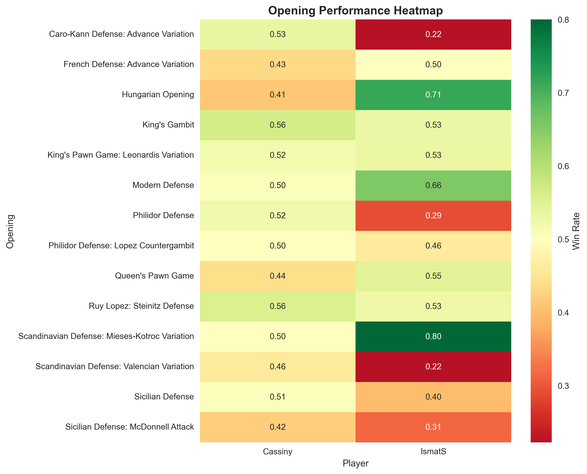

---

## 📈 Chart 15: Performance Volatility

**Key Insights:**
- Performance consistency and stability measurement
- Risk vs. reward analysis in playing style
- Emotional control and decision-making consistency

**Opportunities:**
- Reduce performance volatility for more predictable results
- Identify factors that contribute to inconsistent performance
- Develop mental resilience and emotional regulation

**Actionable Insights:**
- Practice mindfulness and emotional control techniques
- Maintain consistent pre-game preparation routines
- Track mood, energy, and external factors that correlate with performance swings

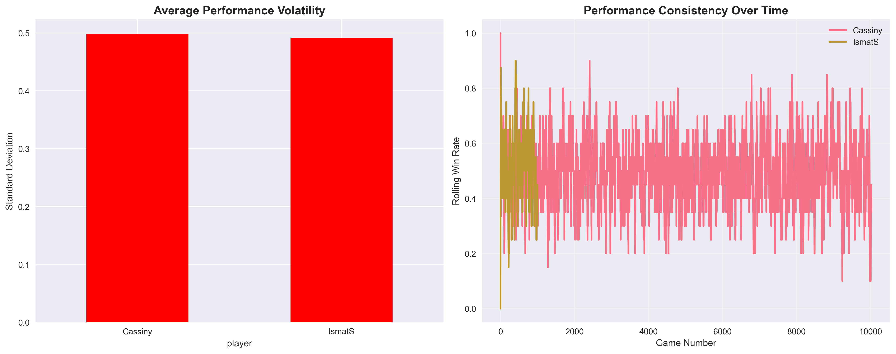

---

## ⏰ Chart 16: Time Investment Analysis

**Key Insights:**
- Relationship between time spent and performance outcomes
- Efficiency of time investment in different game formats
- Resource allocation optimization for chess improvement

**Opportunities:**
- Optimize time allocation across different time controls
- Improve time efficiency in formats with poor time-to-performance ratios
- Balance quantity vs. quality of playing time

**Actionable Insights:**
- Focus practice time on formats with best learning potential
- Develop time management strategies for time-pressured formats
- Consider reducing time in low-return formats to focus on high-impact areas

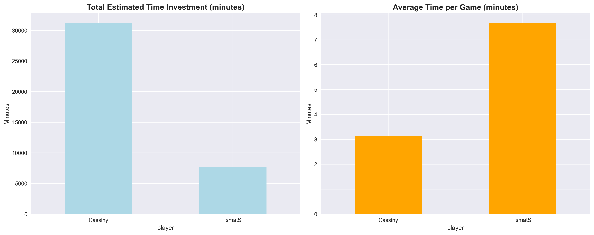

---

## 🎯 Chart 17: Comprehensive Dashboard

**Key Insights:**
- Holistic performance overview combining all major metrics
- Multi-dimensional performance assessment
- Integrated strengths and weaknesses identification

**Opportunities:**
- Prioritize improvement areas based on comprehensive analysis
- Balance training across multiple performance dimensions
- Track overall progress using integrated metrics

**Actionable Insights:**
- Create a balanced training plan addressing all weak areas shown
- Use this dashboard for monthly performance reviews and goal setting
- Focus on the 2-3 most impactful areas for maximum improvement

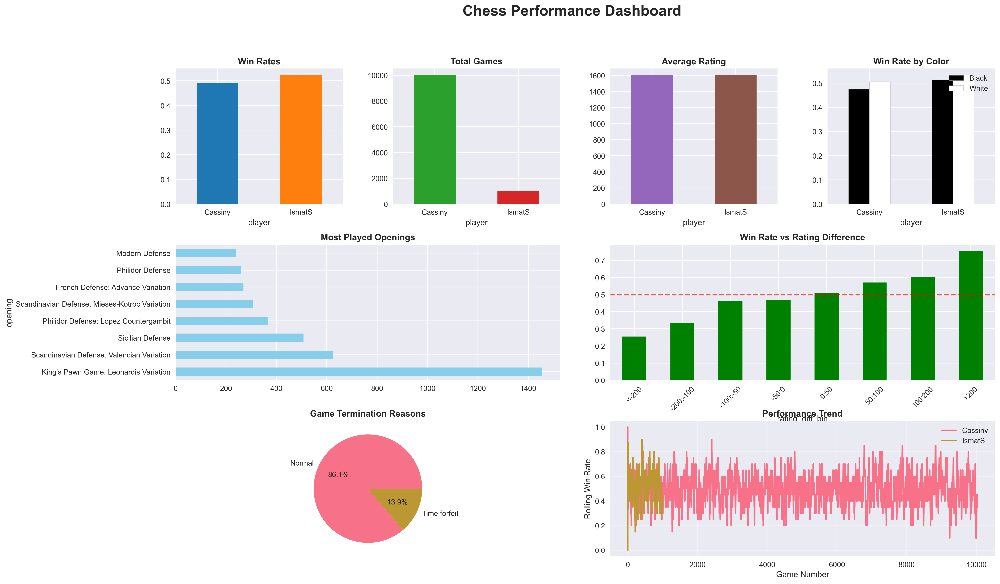

---

## 🧮 Chart 18: Advanced Performance Metrics

**Key Insights:**
- Sophisticated statistical analysis of performance patterns
- Expected vs. actual performance based on rating differences
- Advanced consistency and skill assessment metrics

**Opportunities:**
- Understand performance relative to statistical expectations
- Identify areas where performance exceeds or falls short of predictions
- Develop data-driven training approaches

**Actionable Insights:**
- Focus on areas where actual performance significantly lags expected performance
- Leverage statistical insights to set realistic improvement goals
- Use advanced metrics to measure training effectiveness and progress

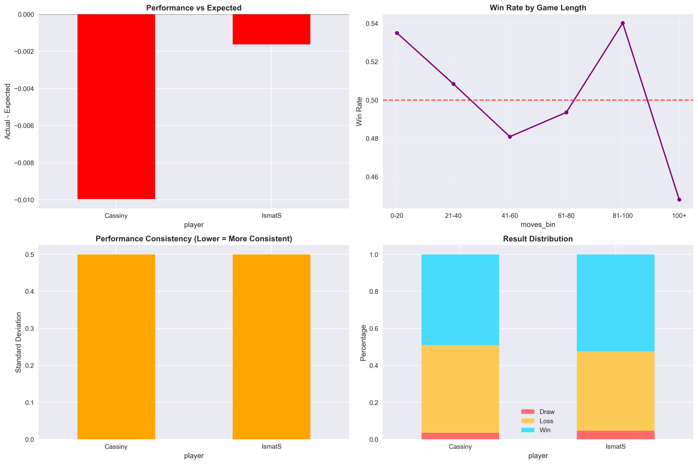

---

## 🎯 Overall Recommendations

Based on the comprehensive analysis of 10,961 games:

### Immediate Actions (1-2 weeks)
1. **Focus on worst-performing openings** identified in Charts 3 and 14
2. **Schedule games during peak performance hours** from Chart 7
3. **Address color-specific weaknesses** shown in Chart 5

### Short-term Goals (1-3 months)
1. **Improve performance against higher-rated opponents** (Chart 9)
2. **Reduce performance volatility** through consistent preparation (Chart 15)
3. **Optimize time control specialization** based on Chart 4 results

### Long-term Development (3-12 months)
1. **Develop comprehensive opening repertoire** using Charts 3 and 14 insights
2. **Build performance consistency** across all time periods (Charts 7, 8, 12, 13)
3. **Track and improve advanced metrics** for sustained improvement (Chart 18)

---

## 📈 Data Summary

- **Total Games Analyzed:** 10,961
- **Player Perspectives:** 11,029
- **Main Players:** IsmatS and Cassiny
- **Analysis Dimensions:** 18 comprehensive metrics
- **Time Period:** Full game history available in PGN files

Generated with comprehensive chess analysis tools and statistical modeling for actionable insights.